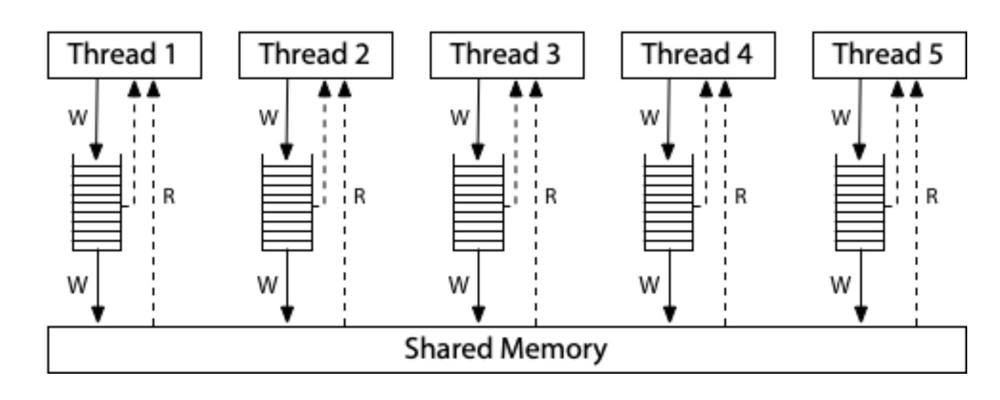

## Hardware vs compiler re-ordering

Hardware reordering is done by the processor. Processor re-ordering is invisible to programs. It only becomes apparent when lock free techniques are used which involves multiple threads.

Compiler reordering is done by the compiler and visible in the assembly code.

the compiler modifies the order of memory interactions for the same reason that the processor does it – performance optimization.


### Why is knowledge of reordering important?

Some algorithms like `petersons` and `dekkers` algorithm are not correct on modern processors due to reordering.

### x86 respects program order (as long as on the same processor/thread)

### Sometimes reorderings are visible also due to intermediate processor store/write cache/buffers.

There is no actual re-orderings happening, but the way the processor stores data in the store buffer (intermeidate processor cache buffer/queue) can make it appear (and read from local cache first) as if there is re-ordering happening.
See for e.g. x86 TSO memory model below




Litmus Test: Write Queue (also called Store Buffer)
Can this program see `r1 = 0, r2 = 0`?

```
// both threads are writing to one location and reading from another unrelated cross-thread location.
// Thread 1           // Thread 2
x = 1                 y = 1
r1 = y                r2 = x
On sequentially consistent hardware: no.
On x86 (or other TSO): yes! (The reason could be Thread1 is reading from local cache/buffer and Thread2 is reading from loca cache/buffer, so both threads are not synchronized with shared memory and flushes have not happened).
```


## Weak vs strong memory models

https://preshing.com/20120930/weak-vs-strong-memory-models/

## Atomic operations

Operations that can be performed without interruption.

## Sequential consistency

The sequence of operations must not be reordered.

## Visibility

Guarantees about when operations on shared memory become visible to other threads. (modern processors have weak memory models and thread caches need to synchronize with main memory).

## Release-Acquire ordering

1. **Release Operation**: Ensures that all previous writes by the thread (to shared data) are visible to other threads.

2. **Acquire Operation**: Ensures that all subsequent reads by the thread (from shared data) see the latest values.

## Use memory barriers to enforce memory ordering

You can enforce correct memory ordering on the processor by issuing any instruction which acts as a **memory barrier**. 

In some ways, this is the only technique you need to know, because when you use such instructions, compiler ordering is taken care of automatically.

How to use it?

1. Certain inline assembly directives in GCC, such as the PowerPC-specific asm volatile("lwsync" ::: "memory")
2. Any Win32 Interlocked operation, except on Xbox 360
3. Many operations on C++11 atomic types, such as load(std::memory_order_acquire)
4. Operations on POSIX mutexes, such as pthread_mutex_lock, pthread_mutex_unlock, pthread_create
5. Operations on POSIX semaphores, such as sem_post
6. Operations on POSIX condition variables, such as pthread_cond_signal


## ARM/Power's relaxed memory model

https://research.swtch.com/hwmm#relaxed

Weaker mem model than x86TSO.

**The conceptual model for ARM and POWER systems is that each processor reads from and writes to its own complete copy of memory, and each write propagates to the other processors independently, with reordering allowed as the writes propagate.**

Here, there is no total store order. Not depicted, each processor is also allowed to postpone a read until it needs the result: a read can be delayed until after a later write. 

In this relaxed model, the answer to every litmus test we’ve seen so far is “yes, that really can happen.”

On ARM/POWER, different threads may learn about different writes in different orders. They are not guaranteed to agree about a total order of writes reaching main memory.