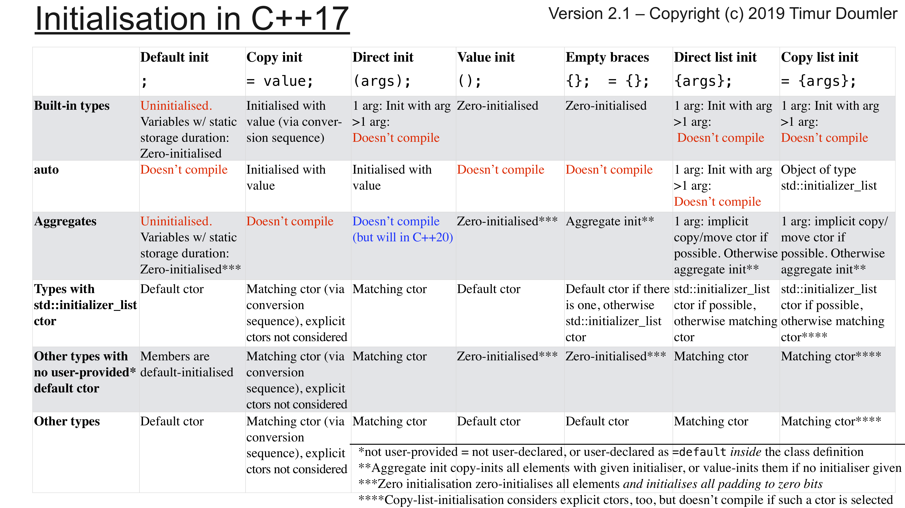

https://www.youtube.com/watch?v=ZfP4VAK21zc

Credit: Timur Doulmer for this image:



### How to write a constructor ?

1. access will usually be public, i.e. in public section
2. no return value
3. same name as class
4. optionally can have member initializer list
5. constructor body `{ ... }`

```cpp
	class Dummy {
	public: // 1.
		Dummy() { // 2,3,5
			std::cout << "Dummy Default constructor" << std::endl;
		}
	};

	Dummy dummy;
```

### Default constructors
A “default constructor” is a constructor that can be called with no arguments.
Constructors with no arguments needed (this can also be constructors that have default values for all arguments).

```cpp
class Dummy {
public:
	Dummy() {
		std::cout << "Dummy Default constructor" << std::endl;
	}
};

Dummy dummy;// "Dummy Default constructor" called
```

**Note**: 
1. Only one default constructor is allowed.
2. if no constructors are specified, compiler generates/adds a default constructor, but the default constructor will not do any initialization.
3. default constructor is invalid, when only user defined non-default constructors are specified.

Default constructors can be deleted by calling `ConstructorName() = delete`, to prevent users from constructing class instance.

#### Default constructor with default values

```cpp
class Dummy {
		int m{};
	public:
		Dummy(int mparam = 2) : m{ mparam } {

		}
		void print() {
			std::cout << m << endl;
		}
	};
```

### Aggregate initialization

Occurs when using `= {Args}` or `o {args}`(since c++11, o being aggregate)

Aggregate initialization initializes aggregates. It is a form of list-initialization (since C++11) or direct initialization (since C++20)

means the use of brace-enclosed initializer lists to initialize all members of an aggregate (i.e. an array or struct [in C++, only certain types of structs count as aggregates]).
```
T object = {arg1, arg2, ...};	(1)	
T object {arg1, arg2, ... };	(2)	(since C++11)
T object = { .designator = arg1 , .designator { arg2 } ... };	(3)	(since C++20)
T object { .designator = arg1 , .designator { arg2 } ... };	(4)	(since C++20)
T object (arg1, arg2, ...);	
```
```cpp
struct Foo{
	int i;
	float j;
}
Foo f = {1, 3.14f};// aggregate initialization
```
An aggregate is one of the following types:
* array type
* class type (typically, struct or union), that has
	- no private or protected direct (since C++17)non-static data members
no user-declared constructors(until C++11)
	- no user-provided constructors (explicitly defaulted or deleted constructors are allowed)(since C++11)(until C++17)

	- no user-provided, inherited, or explicit constructors (explicitly defaulted or deleted constructors are allowed)(since C++17)(until C++20)

	- no user-declared or inherited constructors(since C++20)
	- no virtual, private, or protected (since C++17) base classes
	- no virtual member functions
	- no default member initializers(since C++11)(until C++14)

#### Nested aggregate initialization

```cpp
struct Foo{
	int i;
	int j;
}
struct Bar{
	Foo f;
	int k;
}
int main(){
	Bar b = {{1,2}, 1};
	return b.k;// 1
}
```

### Copy constructor

A copy constructor of class T is a non-template constructor whose first parameter is `T&‍`, `const T&‍`, `volatile T&‍`, or `const volatile T&‍`, and either there are no other parameters, or the rest of the parameters all have default values.

A copy constructor is a special type of constructor used to create a new object as a copy of an existing object.

The copy constructor is called whenever an object is initialized (by direct-initialization or copy-initialization) from another object of the same type (unless overload resolution selects a better match or the call is elided), which includes

1. `initialization`: `T a = b`; or `T a(b)`;, where `b` is of type `T`;
2. `function argument passing`: `f(a)`;, where `a` is of type `T` and `f` is `void f(T t)`;
3. `function return`: `return a;` inside a function such as `T f()`, where `a` is of type `T`, which has `no move constructor`.


**Note**- If you do not provide a copy constructor for your classes, C++ will create a public copy constructor for you, which does a shallow mem cpy of members

#### What does copy constructor signature look like
```cpp
Fraction(const Fraction& fraction){

}
```

### Memberwise Initialization

`Memberwise initialization` simply means that each member of the copy is initialized directly from the member of the class being copied.

### Uniform initialization

Using braces `{}` for initialization,also called `list initialization`.
The braces are also called `braced-init-list` in the spec.

* For aggregate types:
	- aggregate init
* For built-in types:
	- `{a}` is direct init, `= {a}` is copy init
* for class types
	- First greedily try to call a ctor that takes a std::initializer_list
	- If there is none, direct-init (or copy-init if `={a}` and a is single element)

Comes in two flavors:
1. direct-list-initialization
```cpp
Foo foo{1, 2};
```
2. copy-list-initialization
```cpp
Foo f = {1,2};
```
* Uniform initialization prevents implicit narrowing.
E.g. converting floating point to integral values or unsigned to singed
```cpp
// Compiler ERror! converting from double to int needs a narrowing conversion!
int jj{ 4.2 };
```

### Direct initialization

Using round braces `()` for initialization
e.g. 
```cpp
Foo foo(1,2);
int i(3);
```

Compared to copy initialization, this approach
* does not perform a conversion sequence
* can take more than one arguments
* works fine when constructors are declared explicit

PRoblems:
**Most vexing parse**
```cpp
struct Foo{}

struct Bar {
	Bar(Foo){}
}

int main(){
	Bar bar(Foo()); // this is a function declaration, not an initialization :(
}
```

### Value initialization

```
Classname c = ClassName()
```
also has most vexing parse problem.
Not commonly used.

### copy initialization

Occurs when using `= value`, `pass by value`, `return by value`
```
T object = other;	(1)	
T object = {other};	(2)	(until C++11)
f(other)	(3)
return other;	(4)
T array[N] = {other};	(6)	
```
If `T` is a class type and tthe type of `other` is `T` or a class `derived from T`, the `non-explicit constructors of T` are examined and the `best match` is selected by overload resolution. The constructor is then called to initialize the object.

```cpp
int main()
{
    Fraction six = Fraction(6);// implicit conversion to Fraction six(Fraction(6)); which will invoke copy constructor
    std::cout << six;
    return 0;
}
```

Avoid using copy initialization, and use uniform initialization instead.

**Note** - When you pass or return a class by value, that process uses copy initialization.


### default initialization (no initializer)

* variables defined outside function body are given value 0.
* variables of built-in types defined inside a function are unintialized. (random value)
```cpp
int main( ){
    int lll;
    std::cout <<lll <<std::endl;// random value
    return 0;
}
```
* Objects of class type that we do not explicitly initialize have a value that is defined by the class.


### declarations and definitions

variables must be defined once, can be declared many times
```cpp
extern int i; // declaration only, definition elsewhere
int j; // declaraiton and definition
```


### initializer-list based constructors
When a compiler sees an initializer list e.g. `MyIntArray arr{ 5, 4, 3, 2, 1 }; // initializer list`, it automatically converts it into an object of type `std::initializer_list`. Therefore, if we create a constructor that takes a `std::initializer_list` parameter, we can create objects using the initializer list as an input.

`std::initializer_list` lives in the `<initializer_list>` header.


Main usage:
```cpp
#include "Vector.h"

int main()
{
	Vector v1{ 2,3,4,5};
	std::cout << "SEcond element is : " << v1[1] << std::endl;
}
```

```cpp
#pragma once
#include <initializer_list>
//expose vector interface
class Vector {
public:
	Vector(int s);
	Vector(std::initializer_list<double> els);
	double& operator[](int i);
	int size();
private:
	int sz;
	double* elem;
};
```
Implementation:
```cpp
#include "Vector.h"

Vector::Vector(int s) :elem {new double[s]}, sz{s} {}

Vector::Vector(std::initializer_list<double> els)
{
	elem = new double[els.size()];
	int j = 0;
	for (const double* d = els.begin(); d != els.end(); ++d,j++) {
		elem[j] = *d;
	}
}

double& Vector::operator[](int i) {
	return elem[i];
}

int Vector::size() {
	return sz;
}
```

#### Corner cases
`auto` used with `=` and brace initialiser `{}`
```cpp
// assignment operator has different meaning for curly braces initialization of primitive
auto i = { 2 };// type of i is std::initializer_list<int>
auto i2 { 3 }; // type of i2 is int
```


### Constructor matching with initialiser_list

`std::initializer_list<>` constructors have higher priority but the `default constructor` has the highest priority.

```cpp
class X {
	X (int i, const std::string& s);// 1st constructor
	X (const std::string& const std::string& s2);// 2nd constructor
	X (std::initializer_list<int> i1);// 3rd constructor
}

X a(7,"hi");// 1st constructor matches
X b("hi","guy")// 2nd constructor matches
X c(42,43,33); // 3rd constructor matches
X d{}; // 3rd constructor matches

// X e; // not allowed because no default constructor available
```