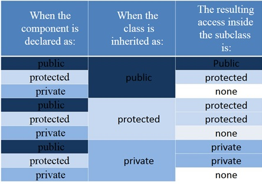

**Inheritance of classes is private by default, you should make it public**

https://www.youtube.com/watch?v=77eueMbWI0Y

### Classic example


Base instantiation happens before derived constructor instantiation.

C++ constructs derived classes in phases, starting with the most-base class (at the top of the inheritance tree) and finishing with the most-child class (at the bottom of the inheritance tree). As each class is constructed, the appropriate constructor from that class is called to initialize that part of the class.


```cpp
#include <iostream>

class Base
{
public:
    int m_id {};

    Base(int id=0)
        : m_id(id)
    {
        std::cout << "Base Constructor\n";
    }
    int getId() const { return m_id; }
};

class Derived: public Base
{
public:
    double m_cost {};
    // Implicit call is made to Base Constructor, 
    // because it has a no-arg constructor/default 
    // constructor/constructor with default values
    Derived(double cost=0.0) 
        : m_cost(cost)
    {
        std::cout << "Derived Constructor\n";
    }
    double getCost() const { return m_cost; }
};

int main()
{
    std::cout << "Instantiating Base\n";
    Base base; // "Base Constructor" is printed

    std::cout << "Instantiating Derived\n";
    Derived derived; // "Base Constructor" is printed first, then "Derived Constructor

    return 0;
}
```

### init problems

C++ prevents classes from initializing inherited member variables in the member initializer list of a constructor. 

In other words, the value of a member variable can only be set in a member initializer list of a constructor belonging to the same class as the variable.
e.g. in above example, you cannot init `m_id` in derived class code.

another possibility:
inherited variables can still have their values changed in the body of the constructor using an assignment.

problem with it:
it wouldn’t work if `m_id` were a const or a reference (because const values and references have to be initialized in the member initializer list of the constructor). 

It’s also inefficient because `m_id` gets assigned a value twice: once in the member initializer list of the Base class constructor, and then again in the body of the Derived class constructor. 

And finally, what if the Base class needed access to this value during construction? It has no way to access it, since it’s not set until the Derived constructor is executed (which pretty much happens last).

Correct way:
```cpp
class Derived: public Base
{
public:
    double m_cost {};

    Derived(double cost=0.0, int id=0) // here we see initing both base and own members
        : Base{ id } // Call Base(int) constructor with value id!
        , m_cost{ cost }
    {
    }

    double getCost() const { return m_cost; }
};
```

### Re-using base functions with Base::fnName

There is **no super keyword** like in some other programming languages (e.g., Java, Python, or JavaScript). Instead use `Base::fnName` to call a function from the base class.


```cpp
class Base
{
protected:
    int m_value {};

public:
    Base(int value)
        : m_value { value }
    {
    }

    void identify() const { std::cout << "I am a Base\n"; }
};

class Derived: public Base
{
public:
    Derived(int value)
        : Base { value }
    {
    }

    int getValue() const  { return m_value; }

    void identify() const
    {
        Base::identify(); // call Base::identify() first
        std::cout << "I am a Derived\n"; // then identify ourselves
    }
};

int main()
{
    Base base { 5 };
    base.identify();

    Derived derived { 7 };
    derived.identify();

    return 0;
}
```

## Changing base access level when inheriting Base 

```cpp
class Base
{
public:
    int m_value {};

    Base(int value)
        : m_value { value }
    {
    }
};
class Derived: private Base {/* ...*/}// treat Base members as private to outside world (main etc)
class Derived: protected Base {/* ... */} // treat Base members as protected to outside world (main etc)
class Derived: public Base {/* ... */} // treat Base members as-is to outside world (main etc)
```



## virtual & override keyword

**Virtual** comes into picture for **same named methods in class hierarchy for overriding**

Usually when a method is called, the reference class's method is called.
If that method is marked virtual, then the method in the most derived class is called.
This is called dynamic dispatch.

1. In the **parent class**, the method must be **marked virtual**
2. In the **derived class**, the method must be **marked override** (optional but recommended for better checking)

### Virtual destructors

**Rule** - **If a class has a virtual function, or if you might plan to do dynamic dispatch/override, base class should have a virtual destructor.**

If a class is intended to be used as a base class, it's generally recommended to declare its destructor as virtual.
This ensures proper cleanup of derived class resources when deleting through a base class pointer.

**But why?** - When a pointer to a base class goes out of scope, the base class destructor is called but the derived class destructor is not called, because baseclass did not have a virtual destructor. Ideally because the instance was Derived class Instance, derived class destructor should also be called.

**Note** - Compiler generated destructors are not virtual!!

```cpp
#include <iostream>

class Base
{
public:
    Base() { std::cout << "Base class constructor" << std::endl; }
    ~Base() { std::cout << "Base class destructor" << std::endl; }
};

class Derived : public Base
{
public:
    Derived() { std::cout << "Derived class constructor" << std::endl; }
    ~Derived() { std::cout << "Derived class destructor" << std::endl; }
};

void doSomething()
{
    std::unique_ptr<Base> instance = std::make_unique<Derived>();
}// Base goes out of scope so only ~Base() destructor is called, to cleanup via ~Derived(), we must make `virtual ~Base()`


int main()
{
    doSomething();
    return 0;
}
```