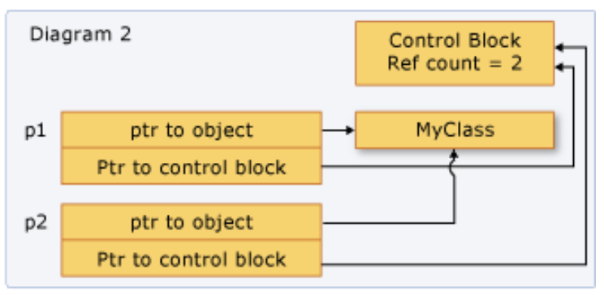

https://learn.microsoft.com/en-us/cpp/cpp/how-to-create-and-use-shared-ptr-instances?view=msvc-170

## Shared ownership

An "owner" is an object or function that can keep the underlying resource alive for as long as it needs it.

All the instances point to the same object, and share access to one "control block" that increments and decrements the reference count whenever a new shared_ptr is added, goes out of scope, or is reset. When the reference count reaches zero, the control block deletes the memory resource and itself.



## Create shared pointers using `make_shared`

```cpp
#include <iostream>
#include <memory> // for std::shared_ptr

class Resource
{
public:
	Resource() { std::cout << "Resource acquired\n"; }
	~Resource() { std::cout << "Resource destroyed\n"; }
};

int main()
{
	// allocate a Resource object and have it owned by std::shared_ptr
	auto ptr1 { std::make_shared<Resource>() };
	{
		auto ptr2 { ptr1 }; // create ptr2 using copy of ptr1, uses copy constructor

		std::cout << "Killing one shared pointer\n";
	} // ptr2 goes out of scope here, but nothing happens

	std::cout << "Killing another shared pointer\n";

	return 0;
} // ptr1 goes out of scope here, and the allocated Resource is destroyed
```

## Pass by value 

Pass the `shared_ptr` by value. This invokes the copy constructor, increments the reference count, and makes the callee an owner. There's a small amount of overhead in this operation, which may be significant depending on how many shared_ptr objects you're passing. Use this option when the implied or explicit code contract between the caller and callee requires that the callee be an owner.

## Pass by reference/const reference

Pass the shared_ptr by reference or const reference. In this case, the reference count isn't incremented, and the callee can access the pointer as long as the caller doesn't go out of scope. Or, the callee can decide to create a shared_ptr based on the reference, and become a shared owner. Use this option when the caller has no knowledge of the callee, or when you must pass a shared_ptr and want to avoid the copy operation for performance reasons.

## Pass underlying pointer/reference to underlying object

Pass the underlying pointer or a reference to the underlying object. This enables the callee to use the object, but doesn't enable it to share ownership or extend the lifetime. If the callee creates a shared_ptr from the raw pointer, the new shared_ptr is independent from the original, and doesn't control the underlying resource. Use this option when the contract between the caller and callee clearly specifies that the caller retains ownership of the shared_ptr lifetime.

If you have to give a helper function access to the underlying pointer, and you know that the helper function will just use the pointer and return before the calling function returns, then that function doesn't have to share ownership of the underlying pointer. It just has to access the pointer within the lifetime of the caller's shared_ptr. In this case, it's safe to pass the shared_ptr by reference, or pass the raw pointer or a reference to the underlying object. Passing this way provides a small performance benefit, and may also help you express your programming intent.

## Use `shrd_ptr.use_count` to get reference count

```cpp
#include <iostream>
#include <memory> // for std::shared_ptr

int main(){
    auto ptr1 { std::make_shared<int>(5) };
    std::cout << "ptr1.use_count() = " << ptr1.use_count() << '\n'; // 1

    {
        auto ptr2 { ptr1 };
        std::cout << "ptr1.use_count() = " << ptr1.use_count() << '\n'; // 2
        std::cout << "ptr2.use_count() = " << ptr2.use_count() << '\n'; // 2
    } // ptr2 goes out of scope here

    std::cout << "ptr1.use_count() = " << ptr1.use_count() << '\n'; // 1
    return 0;
}
```    

## Use `reset(ptr)` to reset shared pointer

`reset(ptr)` detaches from the managed object, and reset it to point to the passed ptr.

```cpp
#include <iostream>
#include <memory> // for std::shared_ptr

int main() {
    auto ptr1 { std::make_shared<int>(5) };
    std::cout << "ptr1 points to " << *ptr1 << '\n'; // 5

    auto ptr2 { ptr1 }; // copy ptr1 into ptr2
    ptr1.reset(); // decrement ptr1's use count and detach it from the managed object

    if (ptr1) { // ptr1 is empty, so skip this
        std::cout << *ptr1 << '\n';
    }

    std::cout << "ptr2 points to " << *ptr2 << '\n'; // 5

    return 0;
}
```