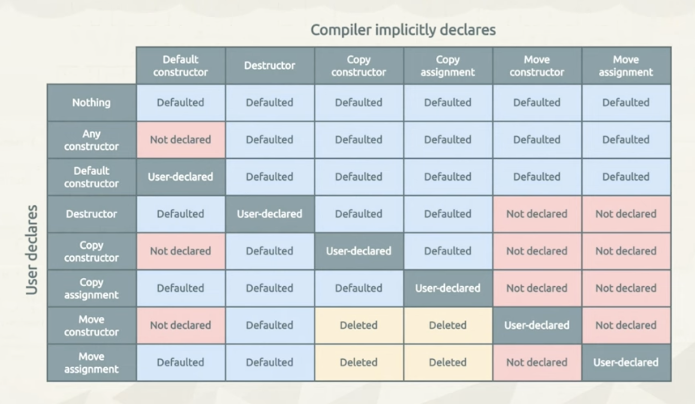
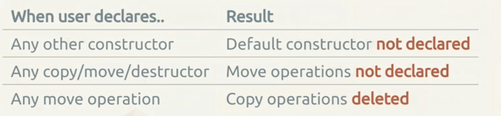
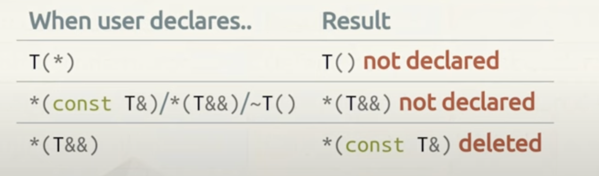
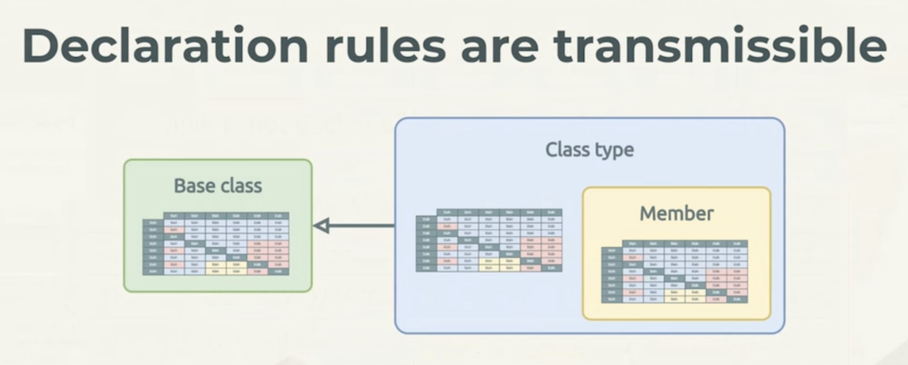

Think of `=delete` as `=disabled`.

**User declared** means you have defined it yourself in sourcefile, even if you have written `=default` or `=delete` in the source file.

https://www.youtube.com/watch?v=ajRTADPXEko Good talk.

## Rules table (Read from left to right i.e user declared -> compiler generated)



### Rules in english and types





### Rules hierarchy



## Rule of 3

If you happen to have to **define 1) descrutctor**, also define 2) copy constructor and 3) copy assignment operator.


## Rule of 5

If you happen to have to **define 1) descrturctor**, also define 2) copy constructor, 3) copy assignment operator, 4) move constructor and 5) move assignment operator.

Or,

**If you define or `=delete` any of the special member functions, then you should define or `=delete` all of them.**

## Data member initialization

### Default initialization (no braces) of Plain class (constructor-less) data member init

1. Data members of fundamental type - (int, pointers) are not initialized (i.e random)
2. Data members of class type are default constructed.

```cpp
int main() {
    Regular r; // note no braces - this is called default initialization
}

class Regular
{
public:
    int i; // uninitialized i.e random
    std::string s; // empty string = ""
    int* p; // uninitialized i.e random
};
```

### Value initialization (empty braces) of Plain class (constructor-less) data member init

**This is almost always what we want**

**Guideline**: Always use empty braces to default initialize objects (also called value init).

1. Data members of fundamental type - (int, pointers) are initialized to 0/nullptr.
2. Data members of class type are default constructed.

```cpp
int main() {
    Regular r{}; // note braces - this is called value initialization
}
class Regular
{
public:
    int i; // 0 when value initialized i.e. Regular r{};
    std::string s; // empty string = ""
    int* p; // nullptr when value initialie i.e. Regular r{};
};
```

**Note** - If you value initialize, but the class has a constructor which does not initialize data members, then data members stay uninitialized.

```cpp
int main() {
    Regular r{}; // note braces - this is called value initialization
}
class Regular
{
public:
    Regular() {} // constructor does not initialize data members, so they stay uninitialized
    int i; // uninitialized i.e random
    std::string s; // empty string = ""
    int* p; // uninitialized i.e random
};
```


## Default constructor

The compiler generates a default constructor if:
1. no user-defined constructors are provided
2. if all data members and base classes can be default constructed.(i.e. they have default constructors)

## What is member initializer list?

Before you enter the body of the constructor, cpp has something known as member initialization list, which is where initialization should happen. What happens in constructor function body is usually called assignment.

**Note** - You must member initialize members in the exact same order as they are declared in the class.

**Prefer member initialization list to assignment in constructor body**

```cpp
class A
{
public:
    // note the member initialization list order is same as declaration order
    A(int i) : i(i), s("Hi"), p(nullptr) {} // member initialization list
    int i;
    std::string s;
    int* p;
};
```

## Destructors

There is always a descructor, even if you don't write one. The compiler generates a default destructor, only if no user-defined destructor is provided.

Destructors are mostly concerned with instances, not static members (as static members/duration live for the program).

**Note** - **Never ever provide a destructor with empty body**. Either:
1. Let the compiler generate the default destructor
2. Or, provide the same behavior via `=default` syntax.

### Behavior of default destructor(compiler generated)

1. Calls the destructor of all data members of class type.
2. If a base class or data member has a user-defined destructor, then that destructor is called.
3. Nothing special happens for data members of fundamental type (int, pointers). So a raw pointer would stay around.

## Copy constructor and Copy Assignment operator

### When does compiler generate copy constructor and copy assignment operator?

The compiler always generates a copy constructor and copy assignment operator if:
1. No user-defined copy constructor or copy assignment operator is provided.
2. and if **no move constructor or move assignment operator** is provided. (If move operations are provided, then copy operations are implicitly deleted).
3. and if all base/data members can be copy constructed/copy assigned. (If any base/data member cannot be copy constructed/copy assigned, then copy operations are implicitly deleted - which is surprising).

### Behavior of the compiler generated copy constructor and copy assignment operator

Shallow copy of data members, memberwise

```cpp
class Widget: Base {
    public: // compiler generated copy constructor is just memberwise copy
        Widget(const Widget& other) : Base(other), i(other.i), s(other.s), p(other.p) {}

        // compiler generated copy assignment operator is just memberwise copy
        Widget& operator=(const Widget& other) {
            Base::operator=(other);
            i = other.i;
            s = other.s;
            p = other.p;// copying raw pointers has bad implications for memory management
            return *this;
        }
}
```

### What if class's data member is not copyable?

**Then the copy operations are implicitly deleted**

```cpp
class NotCopyable
{
public:
    NotCopyable() = default;
    NotCopyable(const NotCopyable &) = delete;
    NotCopyable &operator=(const NotCopyable &) = delete;
};

class B
{
public:
    B() = default;
    NotCopyable nc; // as this is not copyable, B is not copyable (implictly deleted copy ops)
};

int main(){
    B b{};
    // B b2 = b; // Compiler error - copy constructor of b is deleted bcoz it has noncopyable data members
}
```


## Move constructor and Move Assignment operator

### When does compiler generate move constructor and move assignment operator?

The compiler always generates a move constructor and move assignment operator if:
1. No user-defined move constructor or move assignment operator is provided.
2. If **no destructor** and **no copy operation** is declared(i.e. If user defined destructor or copy operation is provided, then move operations are implicitly deleted).
3. If all bases/data members can be copy or move constructed/assigned.

### Behavior of the compiler generated move constructor and move assignment operator

1. Move constructor and move assignment operator are **just memberwise move**.

```cpp
class Widget {
    public:
        Widget(Widget&& other) : i(std::move(other.i)), s(std::move(other.s)), p(std::move(other.p)) {}
        Widget& operator=(Widget&& other) {
            i = std::move(other.i);
            s = std::move(other.s);
            p = std::move(other.p);
            return *this;
        }
}
```


## Checking the status of special member functions using type traits

```cpp
#include <type_traits>
#include <iostream>

// Utility to check if a type T has a default constructor
template <typename T>
constexpr bool has_default_constructor() {
    return std::is_default_constructible<T>::value;
}

// Utility to check if a type T has a deleted default constructor
template <typename T>
constexpr bool has_deleted_default_constructor() {
    return !std::is_default_constructible<T>::value;
}

// Utility to check if a type T has a copy constructor
template <typename T>
constexpr bool has_copy_constructor() {
    return std::is_copy_constructible<T>::value;
}

// Utility to check if a type T has a deleted copy constructor
template <typename T>
constexpr bool has_deleted_copy_constructor() {
    return !std::is_copy_constructible<T>::value;
}

// Utility to check if a type T has a move constructor
template <typename T>
constexpr bool has_move_constructor() {
    return std::is_move_constructible<T>::value;
}

// Utility to check if a type T has a deleted move constructor
template <typename T>
constexpr bool has_deleted_move_constructor() {
    return !std::is_move_constructible<T>::value;
}

// Utility to check if a type T has a copy assignment operator
template <typename T>
constexpr bool has_copy_assignment_operator() {
    return std::is_copy_assignable<T>::value;
}

// Utility to check if a type T has a deleted copy assignment operator
template <typename T>
constexpr bool has_deleted_copy_assignment_operator() {
    return !std::is_copy_assignable<T>::value;
}

// Utility to check if a type T has a move assignment operator
template <typename T>
constexpr bool has_move_assignment_operator() {
    return std::is_move_assignable<T>::value;
}

// Utility to check if a type T has a deleted move assignment operator
template <typename T>
constexpr bool has_deleted_move_assignment_operator() {
    return !std::is_move_assignable<T>::value;
}

// Utility to check if a type T has a destructor
template <typename T>
constexpr bool has_destructor() {
    return std::is_destructible<T>::value;
}

// Utility to check if a type T has a deleted destructor
template <typename T>
constexpr bool has_deleted_destructor() {
    return !std::is_destructible<T>::value;
}

// Example class to test
class Example {
public:
    Example() = default;
    Example(const Example&) = delete;
    Example(Example&&) = default;
    Example& operator=(const Example&) = delete;
    Example& operator=(Example&&) = default;
    ~Example() = default;
};

int main() {
    std::cout << "Example has default constructor: " << has_default_constructor<Example>() << "\n";
    std::cout << "Example has deleted default constructor: " << has_deleted_default_constructor<Example>() << "\n";
    std::cout << "Example has copy constructor: " << has_copy_constructor<Example>() << "\n";
    std::cout << "Example has deleted copy constructor: " << has_deleted_copy_constructor<Example>() << "\n";
    std::cout << "Example has move constructor: " << has_move_constructor<Example>() << "\n";
    std::cout << "Example has deleted move constructor: " << has_deleted_move_constructor<Example>() << "\n";
    std::cout << "Example has copy assignment operator: " << has_copy_assignment_operator<Example>() << "\n";
    std::cout << "Example has deleted copy assignment operator: " << has_deleted_copy_assignment_operator<Example>() << "\n";
    std::cout << "Example has move assignment operator: " << has_move_assignment_operator<Example>() << "\n";
    std::cout << "Example has deleted move assignment operator: " << has_deleted_move_assignment_operator<Example>() << "\n";
    std::cout << "Example has destructor: " << has_destructor<Example>() << "\n";
    std::cout << "Example has deleted destructor: " << has_deleted_destructor<Example>() << "\n";

    return 0;
}
```