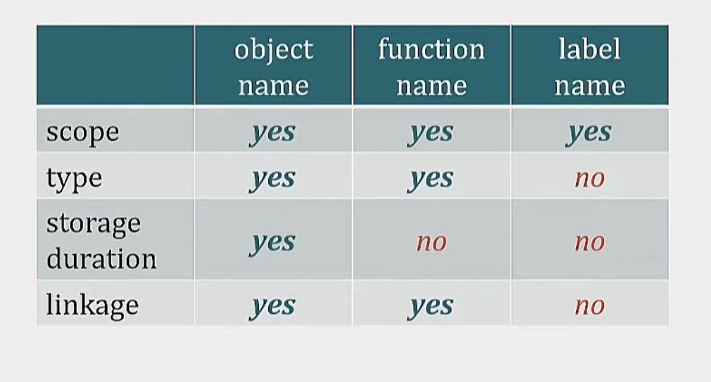
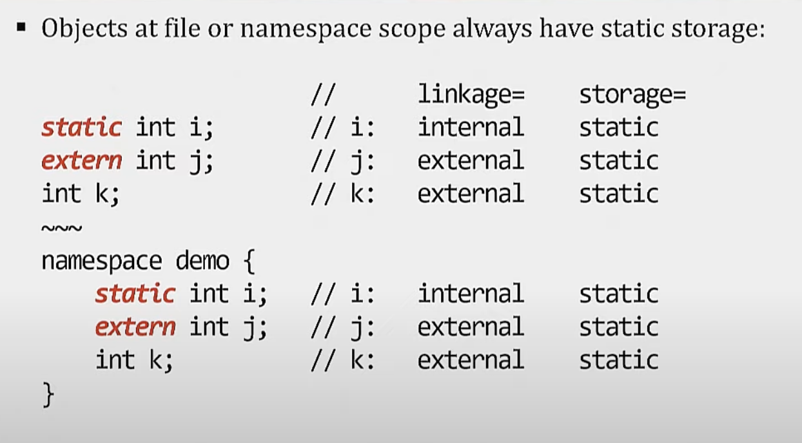

## Entities (that we declare using names)

1. functions
2. types
3. objects
4. constants
5. namespaces
6. templates


## Declaretion name attributes

1. type
2. scope
3. storage duration
4. linkage



## Declaration vs Definition

`Declaration`: It is a program statement that says to the compiler that, Here is a name and some attributes for an entity that is somewhere in the program. A declaration that does not define something is called a `non-defining declaration`, otherwise it would be called a `defining declaration`. A non-defining declaration does not allocate storage for an object/entity.

e.g. 
```cpp
// function declaration (non-defining declaration)
int abs(int v);
```

`Definition`: It is a declaration that says - here is a name and complete set of attributes for an entity that is right here. So all definitions are declarations
An object definition allocates storage for an object/entity.

e.g.
```cpp
// function definition
int abs(int v) {
    return v < 0 ? -v : v;
}
```


## What is a non-defining object declaration?

It has an `extern` keyword and no initializer.

e.g. `extern int m` is a `non-defining object declaration`.

Where as `int m;` and `extern int m = 10;` are both defining declarations.


## Translation units

Rules about scope and linkage are specified around Translation units (`.i` files - files that are preprocessed), not around headers and sources.

### Translation units and object modules

Compiler turns a translation unit into a `.o` object file or object module.
There is 1-to-1 correspondence between a `.i` -> `.o` file.

### Linker combines object files to create executable


## Contents of object files

Mainly contains two things:
1. `data` - actual executable program/code, i.e. machine instructions and values/constants with associated storage. Program sections like `text`, `data`, `bss`, `literal`, `debug`, `comment` etc.
2. `metadata` - metadata used by linker to manage creating the executable

### Object file metadata

**function names and addresses** and **object names and addresses** end up as metadata via `refs`(non-defining declarations) and `defs`(definitions) 


## Symbol table

It is internal data structure managed by the compiler to note:
1. name of entities
2. attributes of corresponding entities.

**Usually symbol table is updated whenever a declaration is introduced or a definition is seen.**

`name lookup` - whenever compiler encounters a reference to already declared entity, it references into the symbol table to get the attributes of the entity.

### What is scope?

 **A scope is a region of text in a single translation unit**. e.g. a function region or a class region or a namespace region or a file region.

### Symbol table and scope

A `name` stays in symbol table as long it is in scope.


### Scope regions in C

1. file scope
2. block scope - e.g. function scope

### Scope regions

1. file scope = global scope (It is a special case of namespace scope). Global scope is treated as just another namespace.
2. block scope = local scope
3. **class (struct/union included) scope** - scope of a class member
4. **namespace scope** - scope of a namespace member


## Scope vs linkage

**Scope only applies to one transalation unit** - global scope does not span translation units. 

### So how do two translation units refer to the same entity?

**Using external linkage** - 


## Storage class specifiers


### IN C

1. static
2. extern
3. auto - not in c++
4. register - not in c++
5. typedef - is a storage class for syntactic convinience.
6. thread_local

### IN C++

1. extern
2. mutable
3. static
4. thread_local


## Storage duration

Storage duration is the lifetime of the storage containing the object. It is not the lifetime of the object itself.

**Storage duration only applies to objects**. It does not apply to functions, types, namespaces, templates.

### Types of storage duration

1. static - allocated on program startup and deallocated on program exit
2. thread - allocated on thread startup and deallocated on program exit
3. automatic - allocated on block start and deallocated on block exit
4. dynamic - malloc/free or new/delete carved off the heap

## Linkage

### Types of linkage

1. external linkage - same entity across all translation units.
2. internal linkage - not available outside file/translation unit.
3. no linkage - scope local variable have no linkage
4. (In c++20) module linkage

### What is external linkage?

External linkage helps us specify same entity across all translation units.


### Functions at namespace/file scope in C++ have external linkage by default

### Class member functions also have external linkage by default

```cpp
class Widget {
public:
    void foo(); // foo has external linkage
}
```

### Static on global functions changes linkage only

`static` makes the linkage internal, but does not change the storage duration (since functions do not have storage duration).

```cpp
static int f(int); // make linkage internal, not visible in other Translation units
```

### static on class member functions does not affect linkage, but removes this.

This is what makes class members static - type level members instead of instance level.

https://www.youtube.com/watch?v=f3FVU-iwNuA

### objects at file or namespace scope have external linkage & static storage by default



### Storage duration specifiers

