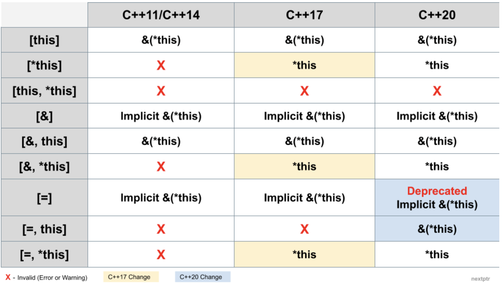

lambdas are anonymous functions

https://learn.microsoft.com/en-us/cpp/cpp/lambda-expressions-in-cpp?view=msvc-170&viewFallbackFrom=vs-2019

 a function object is an instance of a class, for which the call operator ( operator`()` ) is overloaded. This means that a function object is an object that behaves like a function. The main difference between a function and a function object is: a function object is an object and can, therefore, have stated.

### core syntax

```cpp
[capture-list](parameters) -> returntype {
    // function body
}
```

`returntype` is optional

### most basic example

```cpp
auto func = []() {
    std::cout << "hello world" << std::endl;
};

func();
```


### How to think about capture?

Just add `auto` in front of the statements in `[]`.
If there is a single name, e.g. `[a]`, then think of it as `auto a = a` i.e. copy the value of `a` into the lambda function.

If there is a single name reference e.g. `[&a]`, then think of it as `auto& a = a` i.e. reference the value of `a` into the lambda function.

### capture lists

all free variables need to be explicitly specified in capture list
else it will be compiler error

#### capture by value

`Capture by value`: what we have in the
lambda function is a copy. 

**values captured by value can't be modified in the body of the lambda function by default**

Value capturing (i.e copy) happens at lambda definition time,
and further changes to the captured value outside lambda are unknon to the lambda.

```cpp
int c{42};
auto func = [c](){
    std::cout << "Value of c inside lambda" << c << std::endl;// always prints 42, even after c is modified later in the program
};

for(size_t i{}; i<5; i++) {
    std::cout << "outer value : " << c << std::endl;
    func();
    ++c;
}
```

#### capture all by value

Use `=` inside capture list

```cpp
auto func = [=](){
    std::cout << "Value of c inside lambda" << c << std::endl;// always refers outer one when executing
};
```


#### capture by reference

`Capture by value`: what we have in the
lambda function is an alias for the outer one.

```cpp
int c{42};
auto func = [&c](){
    std::cout << "Value of c inside lambda" << c << std::endl;// always refers outer one when executing
};

for(size_t i{}; i<5; i++) {
    std::cout << "outer value : " << c << std::endl;
    func();
    ++c;
}
```


#### capture all by reference

Use `&` inside capture list

```cpp
auto func = [&](){
    std::cout << "Value of c inside lambda" << c << std::endl;// always refers outer one when executing
};
```

## Non-local lambda function cannot have a capture default

The error message "non-local lambda expression cannot have a capture-default" typically occurs in C++ when you're trying to use a capture-default (= or &) in a lambda expression that is not local to a function.

A capture-default is only allowed for lambdas inside a function.

```cpp
#include <stdio.h>

int g = 10;

auto kitten = [=]() { return g+1; };// Compiler error:  non-local lambda expression cannot have a capture-default
auto cat = [g=g]() { return g + 1; };

int main() {
  g = 20;
  printf("%d %d", kitten(), cat());
}
```


## Captureless lambdas can be converted to raw function pointers

```cpp
#include <stdio.h>
int main(){
    int (*fp)(int) = [](int x) { return x +1; };// saving lambda in a raw function pointer
}
```


## Per-lambda mutable state

**By default mutation of data member is not allowed**

```cpp
#include<iostream>

int main() {

// per_lambda_mutable_state.cpp:7:34: error: cannot assign to a variable captured by copy in a non-mutable lambda
  auto counter = [ctr=0]() { ctr = ctr+1; return ctr; };

  std::cout << "ctr = " << counter() << std::endl;
  std::cout << "ctr = " << counter() << std::endl;

  return 0;
}
```

We have to mark it `mutable` to make it non-const.

```cpp
#include<iostream>

int main() {

  auto counter = [ctr=0]() mutable { ctr = ctr+1; return ctr; };

  std::cout << "ctr = " << counter() << std::endl; // 1
  std::cout << "ctr = " << counter() << std::endl; // 2

  return 0;
}
```

## Use lambdas for complex initialization of const variables

```cpp
#include <iostream>
#include <vector>
int main() {
    // inline const initialization using a immediate lambda
    const std::vector<int> v = [] {
        std::vector<int> v;
        for (int i = 0; i < 10; ++i) {
        v.push_back(i);
        }
        return v;
    }();

    const widget x = [&]{
        widget val;                                // assume that widget has a default constructor
        for (auto i = 2; i <= N; ++i) {            // this could be some
            val += some_obj.do_something_with(i);  // arbitrarily long code
        }                                          // needed to initialize x
        return val;
    }();
}
```

## Expansion insights


### Capture by value

```cpp
#include <cstdio>
int main()
{
  int j = 2;
  	auto isEven = [=](int i)
  {
      printf("j = %d",j);
    return (i % 2) == 0;
  };
}
```

Desugared version on cppinsights.io
```cpp
#include <cstdio>

int main()
{
  int j = 2;
    
  class __lambda_6_18
  {
    public: 
    inline /*constexpr */ bool operator()(int i) const
    {
      printf("j = %d", j);
      return (i % 2) == 0;
    }
    
    private: 
    int j;
    
    public:
    __lambda_6_18(int & _j)
    : j{_j}
    {}
    
  };
  
  __lambda_6_18 isEven = __lambda_6_18{j}; // capture init/copying happens on lambda declaration itself, not waiting till use
  return 0;
}
```

## `this` capture in lambdas, captures the enlosing object

By default, `this` is not captured in lambdas, it's capture needs to be specified explicitly or you will get an error.

```cpp
#include <iostream>

struct MyStruct
{
    void Function()
    {
        auto f = [this]()
        {
            // capturing this and renaming this as self inside the lambda
            auto &self = *this; // this is a pointer to obj
            self.counter++;
            std::cout << " counter inside lambda " << self.counter << std::endl;
        };
        f();
        std::cout << " counter outside lambda " << counter << std::endl;
    }
    int counter{0};
};

int main()
{
    MyStruct instance;
    instance.Function();
    instance.Function();
    instance.Function();
    return 0;
}
```

Or you can make `self` variable before making lambda like `auto &self = *this;` and use `self` inside lambda:
```cpp
class MyClass {
public:
    int value;

    MyClass(int v) : value(v) {}

    void printValue() const {
        auto& self = *this; // Capture `this` as `self` before defining the lambda
        auto lambda = [&self]() {
            std::cout << "Value: " << self.value << std::endl;
        };

        lambda();
    }
};
```

### this capture in lambda

Here, `*this` means the current object, and therefore `&(*this)` denotes a reference to the current object. Also, if a capture clause implicitly or explicitly captures this, conceptually, it captures `&(*this)`.

credits to guide at - https://www.nextptr.com/tutorial/ta1430524603/capture-this-in-lambda-expression-timeline-of-change



## Generic lambdas

Generic lambdas, introduced in C++14, are a powerful feature that allows lambdas to accept arguments of any type. This is achieved using the `auto` specifier in the parameter list. When combined with `auto&&`, generic lambdas become even more flexible, enabling perfect forwarding and allowing the lambda to handle both lvalues and rvalues efficiently.

### Generic Lambdas

A generic lambda is a lambda that can accept arguments of any type. This is achieved by using the `auto` specifier in the parameter list. Here's a simple example:

```cpp
auto add = [](auto a, auto b) {
    return a + b;
};
```

In this example, the lambda `add` can accept arguments of any type that supports the `+` operator. This makes the lambda highly reusable and flexible.

### Type Safety

Generic lambdas are type-safe because the type of the arguments is deduced at compile time. This means that any type mismatches or invalid operations will result in compile-time errors, rather than runtime errors.

For example, consider the following lambda:

```cpp
auto print = [](auto value) {
    std::cout << value << std::endl;
};
```

If you pass an argument to `print` that cannot be streamed to `std::cout`, you will get a compile-time error. This ensures that the lambda is used correctly and helps catch potential bugs early in the development process.

### `auto&&` and Perfect Forwarding

Using `auto&&` in the parameter list of a generic lambda enables perfect forwarding. Perfect forwarding is a technique that allows the lambda to preserve the value category (lvalue or rvalue) of the arguments passed to it. This is important for several reasons:

1. **Efficiency**: Perfect forwarding allows the lambda to avoid unnecessary copies or moves, which can improve performance.
2. **Flexibility**: Perfect forwarding allows the lambda to accept both lvalues and rvalues, making it more versatile.
3. **Compatibility**: Perfect forwarding allows the lambda to work with functions that require specific value categories, such as constructors that accept rvalue references.

Here's an example that demonstrates perfect forwarding with a generic lambda:

```cpp
auto wrap = [](auto&& value) {
    return [value = std::forward<decltype(value)>(value)]() mutable {
        return value;
    };
};
```

In this example, the lambda `wrap` accepts an argument of any type and returns a new lambda that captures the argument by value. The `std::forward` function is used to preserve the value category of the argument.

### Use Cases

Generic lambdas with `auto&&` have many use cases. Here are a few examples:

1. **Utility Functions**: Generic lambdas can be used to create utility functions that work with any type. For example, a lambda that applies a function to a range of values can be implemented as a generic lambda.

```cpp
auto apply = [](auto&& func, auto&& range) {
    for (auto&& value : range) {
        func(value);
    }
};
```

2. **Visitors**: Generic lambdas can be used to implement the visitor pattern, which allows different behavior based on the type of the argument. The example you provided earlier demonstrates this use case.

3. **Wrappers**: Generic lambdas can be used to create wrappers around other functions or lambdas, adding additional behavior or modifying the input or output. The `wrap` example above demonstrates this use case.

4. **Callbacks**: Generic lambdas can be used as callbacks in algorithms or asynchronous operations, allowing the callback to handle any type of input.

```cpp
auto async_operation = [](auto&& callback) {
    // Perform some asynchronous operation
    auto result = perform_operation();
    callback(result);
};
```

In conclusion, generic lambdas with `auto&&` are a powerful feature in modern C++ that provide type safety, efficiency, and flexibility. They have many use cases and can help make code more reusable, maintainable, and expressive.