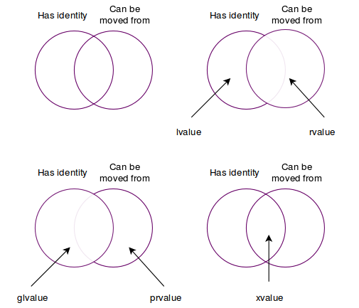

### delete nullptr is ok i.e. no-op


### categories 
1. An `lvalue` (so-called, historically, because lvalues could appear on the left-hand side of an assignment expression) designates a function or an object. [Example: If E is an expression of pointer type, then *E is an lvalue expression referring to the object or function to which E points. As another example, the result of calling a function whose return type is an lvalue reference is an lvalue.]
2. An `xvalue` (an “eXpiring” value) also refers to an object, usually near the end of its lifetime (so that its resources may be moved, for example). An xvalue is the result of certain kinds of expressions involving rvalue references. [Example: The result of calling a function whose return type is an rvalue reference is an xvalue.]
3. A `glvalue` (“generalized” lvalue) is an lvalue or an xvalue.
4. An `rvalue` (so-called, historically, because rvalues could appear on the right-hand side of an assignment expression) is an xvalue, a temporary object or subobject thereof, or a value that is not associated with an object.
5. A `prvalue` (“pure” rvalue) is an rvalue that is not an xvalue. [Example: The result of calling a function whose return type is not a reference is a prvalue]


### digram (courtesy of bajamircea)




https://www.fluentcpp.com/2018/02/06/understanding-lvalues-rvalues-and-their-references/
### lvalue

Locator value - l-values have assigned memory address.

#### lvalue reference

L-value references can only be initialized with modifiable `l-values`. i.e. does not accept temporaries.

|-- L-value reference ---|---	Can be initialized with ---|--- Can modify ---|
|Modifiable l-values	|Yes	|Yes|
|Non-modifiable l-values	|No	|No|
|R-values	|No	|No|


#### lvalue reference to const 

L-value references to const objects can be initialized with `l-values` and `r-values` alike. However, those values can’t be modified. Think of them as read-only references and are compatible with both variables and temporaries(i.e. lvalues and rvalues)

| L-value reference to const	| Can be initialized with	| Can modify|
|Modifiable l-values	|Yes	|No|
|Non-modifiable l-values	|Yes	|No|
|R-values	|Yes	|No|

### rvalue

everything that is not lvalue, e.g.
literals like `5`
temporary value slike `x + 1`
anonymous objects `Fraction(5,2)`

#### rvalue references

C++11 adds a new type of reference called an r-value reference, denoted via double ampersand `&&`. 
An r-value reference is a reference that is designed to be initialized with an r-value (only) i.e. temporaries. i.e. create overloaded functions that only accept temporaries.

| R-value reference	| Can be initialized with	|Can modify|
|Modifiable l-values	|No	|No|
|Non-modifiable l-values	|No	|No|
|R-values	|Yes	|Yes|


Rvalue references cannot be initalized with lvalues, i.e. only temporaries
```cpp
int x { 5};
int &lref {x};// lref is lvalue reference
int && rref {5}; // cannot use x here, rref is rvalue reference
rref = 7; // free to modify values

int&& rr2 {rref};  // compiler error
```

r-value references extend the lifespan of the object they are initialized with to the lifespan of the r-value reference.
 r-value references allow you to modify the r-value

typical use case is function overloads:
```cpp
void fun(const int &lref) // l-value arguments will select this function
{
	std::cout << "l-value reference to const\n";
}

void fun(int &&rref) // r-value arguments will select this function, temporaries select this also this is modifiable so useful
{
	std::cout << "r-value reference\n";
}

int main()
{
	int x{ 5 };
	fun(x); // l-value argument calls l-value version of function
	fun(5); // r-value argument calls r-value version of function
	return 0;
}

```

#### rvalue references to const
non modifiable rvalue references

| R-value reference to const	|Can be initialized with	|Can modify|
|Modifiable l-values	|No	|No|
|Non-modifiable l-values	|No	|No|
|R-values	|Yes	|No|

### move semantics
C++11 defines two new functions in service of move semantics: a `move constructor`, and a `move assignment operator`. Whereas the goal of the copy constructor and copy assignment is to make a copy of one object to another, the goal of the move constructor and move assignment is to move ownership of the resources from one object to another (which is typically much less expensive than making a copy).

`copy` flavors of these functions take a `const l-value reference parameter`, 
the `move` flavors of these functions use `non-const r-value reference parameters`

if we construct an object or do an assignment where the argument is an r-value, then we know that r-value is just a temporary object of some kind. Instead of copying it (which can be expensive), we can simply transfer its resources

### When are the move constructor and move assignment called?

The move constructor and move assignment are called when those functions have been defined, and the argument for construction or assignment is an r-value. Most typically, this r-value will be a literal or temporary value.

Move constructor take a non-const rvalue reference as an argument
e.g.

```cpp
	// Move constructor
	// Transfer ownership of a.m_ptr to m_ptr
	Auto_ptr4(Auto_ptr4&& a) noexcept
		: m_ptr(a.m_ptr)
	{
		a.m_ptr = nullptr; // we'll talk more about this line below
	}
```
Move assignment operator:
```cpp
	// Move assignment
	// Transfer ownership of a.m_ptr to m_ptr
	Auto_ptr4& operator=(Auto_ptr4&& a) noexcept
	{
		// Self-assignment detection
		if (&a == this)
			return *this;

		// Release any resource we're holding
		delete m_ptr;

		// Transfer ownership of a.m_ptr to m_ptr
		m_ptr = a.m_ptr;
		a.m_ptr = nullptr; // we'll talk more about this line below

		return *this;
	}
```
Usage:
```cpp

Auto_ptr4<Resource> generateResource()
{
	Auto_ptr4<Resource> res(new Resource);
	return res; // this return value will invoke the move constructor
}

int main()
{
	Auto_ptr4<Resource> mainres;
	mainres = generateResource(); // this assignment will invoke the move assignment

	return 0;
}
```


### std::move

takes in a lvalue, and converts it to rvalue, i.e. temporary, so that correct 
move constructor (which takes in rvalue reference) will be invoked(that does the stealing.)

### How do I write my move constructor?

Write a function with argument `ClassName(ClassName&& startTemp)` and do all the 
stealing, i.e. shallow copy and cleanup the other.

Goal of move constructor should be:
1. steal contents of other/temp into this.
2. leave other/temp in a valid undefined state.

### How do I write my move assignment operator?

Similar to move constructor, but properly empty out/cleanup the other reference, 
e.g. any pointers should be set to `nullptr` , so that `delete nullptr` is ok i.e. no-op.

### Difference

```cpp
MyString apple ="Apple";
MyString a2 = std::move(apple); // move constructor called.

MyString a3;
a3 = std::move(a2); // move assignment called  
```

## Universal references (Also known as forwarding reference)

In C++, **a universal reference is a type of reference that can bind to any type of object, including lvalues and rvalues.** Universal references were introduced in C++11 as a way to improve the flexibility and expressiveness of the language.

**What is a universal reference?**

A universal reference is a reference that is declared using the syntax `T&&`, where `T` is a type parameter. The `&&` symbol is called the "forwarding operator". When a universal reference is used as a function parameter, it can bind to any type of object, including:

Note - A universal has r-value like syntax, i.e. `&&`, but **type deduction** should also be involved i.e. `T&&`.

* Lvalues (e.g., variables, references)
* Rvalues (e.g., temporaries, literals)
* Const and non-const objects
* Volatile and non-volatile objects

**How do universal references work?**

When a universal reference is used as a function parameter, the type `T` is deduced by the compiler based on the type of the argument passed to the function. The type `T` can be any type, including a reference type.

Here are some examples to illustrate how universal references work:

**Example 1: Binding to an lvalue**
```cpp
template <typename T>
void foo(T&& x) {
    // x is an lvalue reference to an int
}

int x = 5;
foo(x); // T is deduced to be int&
```
In this example, the universal reference `x` binds to the lvalue `x`, which is an `int` variable. The type `T` is deduced to be `int&`, which is an lvalue reference to an `int`.

**Example 2: Binding to an rvalue**
```cpp
template <typename T>
void foo(T&& x) {
    // x is an rvalue reference to an int
}

foo(5); // T is deduced to be int
```
In this example, the universal reference `x` binds to the rvalue `5`, which is an `int` literal. The type `T` is deduced to be `int`, which is an rvalue type.

**Example 3: Binding to a const object**
```cpp
template <typename T>
void foo(T&& x) {
    // x is a const lvalue reference to an int
}

const int x = 5;
foo(x); // T is deduced to be const int&
```
In this example, the universal reference `x` binds to the const lvalue `x`, which is a `const int` variable. The type `T` is deduced to be `const int&`, which is a const lvalue reference to an `int`.

**Example 4: Forwarding**

Universal references can also be used to forward arguments to another function. This is useful when you want to preserve the original type and value category of the argument.
```cpp
template <typename T>
void foo(T&& x) {
    bar(std::forward<T>(x)); // forward x to bar
}

void bar(int& x) {
    // x is an lvalue reference to an int
}

void bar(int&& x) {
    // x is an rvalue reference to an int
}

int x = 5;
foo(x); // calls bar(int&)
foo(5); // calls bar(int&&)
```
In this example, the universal reference `x` is forwarded to the `bar` function using `std::forward`. The type `T` is deduced based on the type of the argument passed to `foo`, and the original type and value category of the argument are preserved when calling `bar`.

**Conclusion**

Universal references are a powerful feature in C++ that allow you to write flexible and expressive code. They can bind to any type of object, including lvalues and rvalues, const and non-const objects, and volatile and non-volatile objects. By using universal references, you can write functions that can handle a wide range of input types and value categories, making your code more generic and reusable.

## Forwarding references

Forwarding references are a type of reference in C++ that can be used to forward arguments to another function while preserving the original type and value category of the arguments. Here are some use cases and examples of forwarding references:

**Use cases:**

1. **Forwarding arguments to another function**: Forwarding references can be used to forward arguments to another function while preserving the original type and value category of the arguments.
2. **Implementing move semantics**: Forwarding references can be used to implement move semantics, which can improve performance by avoiding unnecessary copies of objects.
3. **Implementing perfect forwarding**: Forwarding references can be used to implement perfect forwarding, which ensures that the original type and value category of the arguments are preserved when forwarding them to another function.

**Examples:**

**Example 1: Forwarding arguments to another function**
```cpp
template <typename T>
void foo(T&& x) {
    bar(std::forward<T>(x)); // forward x to bar
}

void bar(int& x) {
    // x is an lvalue reference to an int
}

void bar(int&& x) {
    // x is an rvalue reference to an int
}

int x = 5;
foo(x); // calls bar(int&)
foo(5); // calls bar(int&&)
```
In this example, the `foo` function takes a forwarding reference `x` and forwards it to the `bar` function using `std::forward`. The `bar` function has two overloads, one for lvalue references and one for rvalue references. The `foo` function preserves the original type and value category of the argument `x` when forwarding it to `bar`.

**Example 2: Implementing move semantics**
```cpp
class MyClass {
public:
    MyClass(MyClass&& other) noexcept {
        // move constructor
    }
};

template <typename T>
void foo(T&& x) {
    MyClass obj = std::forward<T>(x); // move construct obj from x
}

MyClass obj;
foo(std::move(obj)); // move construct obj from x
```
In this example, the `foo` function takes a forwarding reference `x` and uses it to move construct an object of type `MyClass`. The `std::forward` function is used to preserve the original type and value category of the argument `x`, which is an rvalue reference in this case.

**Example 3: Implementing perfect forwarding**
```cpp
template <typename T>
void foo(T&& x) {
    bar(std::forward<T>(x)); // forward x to bar
}

template <typename T>
void bar(T&& x) {
    // x is a forwarding reference
}

int x = 5;
foo(x); // calls bar(int&)
foo(5); // calls bar(int&&)
```
In this example, the `foo` function takes a forwarding reference `x` and forwards it to the `bar` function using `std::forward`. The `bar` function also takes a forwarding reference `x`, which preserves the original type and value category of the argument `x`. This is an example of perfect forwarding, where the original type and value category of the argument are preserved throughout the call chain.

These are just a few examples of the use cases and examples of forwarding references in C++. Forwarding references are a powerful tool that can be used to write more efficient and expressive code, and are an important part of modern C++ programming.